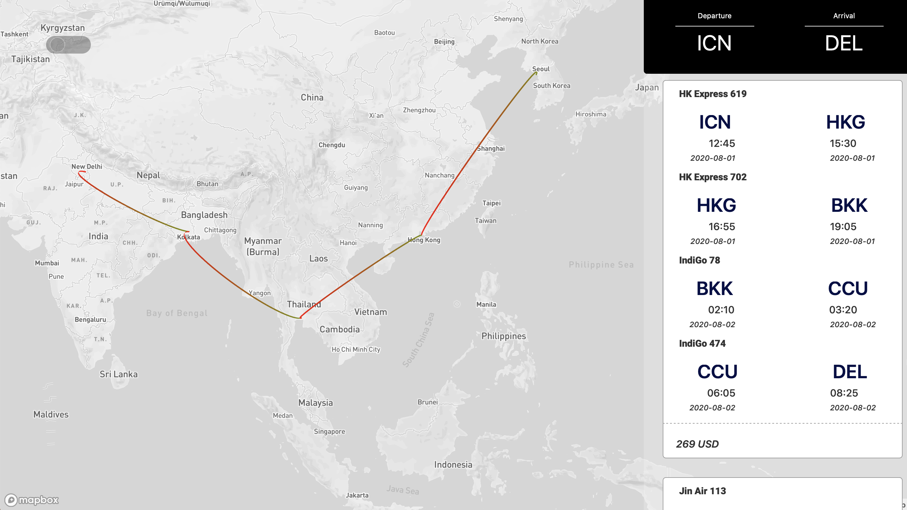

# React with DeckGL and Leaflet

<br>Draw ArcLayer on MapBox Map</br>
Deck.Gl is Datavisualization Tool [Deck.GL](https://deck.gl)


[ArcLayerCode](src/component/deckgl/ArcLayer.js)

[Demo](https://94rising.xyz/flights)
# Dependency
```
React, Deckgl
```